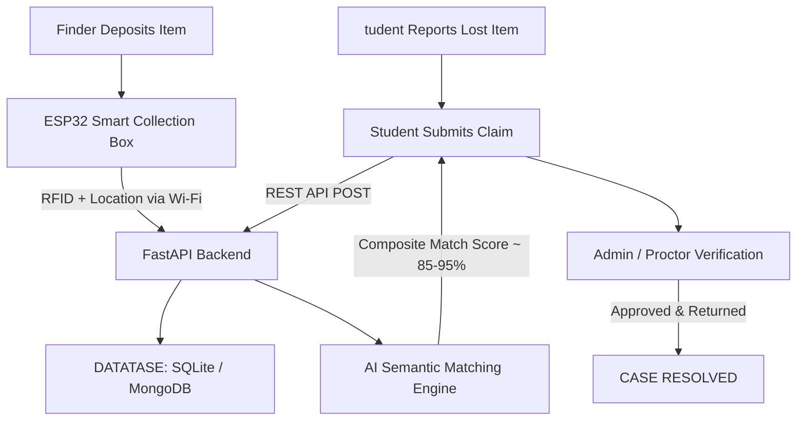

# AKTU MINI PROJECT REPORT

PROJECT TITLE: AI + IoT Smart Lost & Found System
DEQUEST: Branch: B.Tech (CSE / IT / ECE)  
Semester: III (3rd Semester)  
Affiliated University: Dr. A.P.J. Abdul Kalam Technological University (AKTU, Lucknow)

---

## ABSTRACT

In college campuses, students frequently misplace valuable personal belongings such as identity cards, electronic earbuds, calculators, wallets, and keys. Traditional recovery methods relying on unstructured WhatsApp groups, notice boards, or manual security registers result in a recovery rate below 25% due to data fragmentation, lack of timestamping, spatial ambiguity, and slow manual searching.

This project presents an end-to-end Intelligent Campus Lost & Found Platform combining physical IoT Smart Collection Dropboxes (ESP32 + RFID + OLED + Servo Lock) with an AI Semantic Matching Engine running on FastAPI and a modern React/Tailwind Web UI. When an item is deposited, the IoT dropbox automatically registers the temporary RFID ID, physical location, and timestamp. The Intelligent Matching Engine calculates a composite match score using TF-IDF semantic embeddings and multi-attribute weighting (category, color, brand, spatial zone, and time), yielding real-time match notifications. Student ownership is verified by campus administrators via secret proof questions before final dispatch, reducing lost item recovery time from days to hours.

---

## 1. INTRODUCTION

In universities with thousands of students, item misplacement is a persistent daily challenge. When an item is found, finders face friction in finding security personnel, leading to items being left on desks or taken away. Moreover, manual registers lack searchability and students are unaware when their items have been retrieved.

This project bridges physical interaction and digital intelligence through:
1. **IoT Smart Collection Dropboxes** strategically placed at the Library, Canteen, Main Gate, and Admin Block.
2. **AI Semantic Matching Engine** that automates description and attribute comparison.
3. **Centralized Web Application** for realtime student reporting and admin token-verified dispatch.

---

## 2. SYSTEM ARCHITECTURE

---

## 3. HARDWARE & SOFTWARE SPECIFICATIONS

### Hardware9º1. **Microcontroller:** ESP32 Dev Board (Dual-Core 240 MHz, 4MB Flash, Wi-Fi + BLE)
2. **RFID Reader:** RC522 (13.56 MHz SPI Module)
3. **Display:** 0.96 Inch I5C OLED (SSD1306, 128x64)
4. **Actuator:** SG90 Micro Servo Motor (PWMDoor Lock)
5. **Feedback;ª* 5V Piezoelectric Buzzer
 
### Software:
1. **Backend Framework;ª* FastAPI (Python 3.11+ - 3.13)
2. **Database:** SQLite / MongoDB
3. **Frontend:** Modern Tailwind CSS, FontAwesome, Chart.js
4. **AI Engine:** TF-IDF Vectorizer + Cosine Similarity + Multi-Attribute Weighted Matching

---

## 4. AI SEMANTIC MATCHING FORMULA

The composite match score is determined as:
\\[ \\text{Final Score} = (0.35 \\times S_\text{text}) + (0.20 \\times S_\text{cat}) + (0.15 \\times S_\text{color}) + (0.10 \\times S_\text{brand}) + (0.10 \\times S_\text{loc}) + (0.10 \\times S_\text{time}) \\]

---

## 5. CONCLUSION

This project successfully integrates IoT platforms with AI NLP embeddings to automate the campus lost & found lifecycle, reducing student lost item recovery time significantly.
